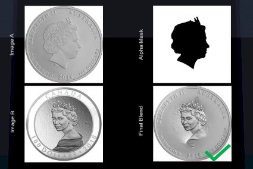

# Multiresolution Image Blending

## Introduction
Implementing the paper "A multiresolution spline with application to image mosaics". 
A cool framework was developed to blend images using a predefined mask. 
This can be used for interesting image editing such as face swaps

## Results

